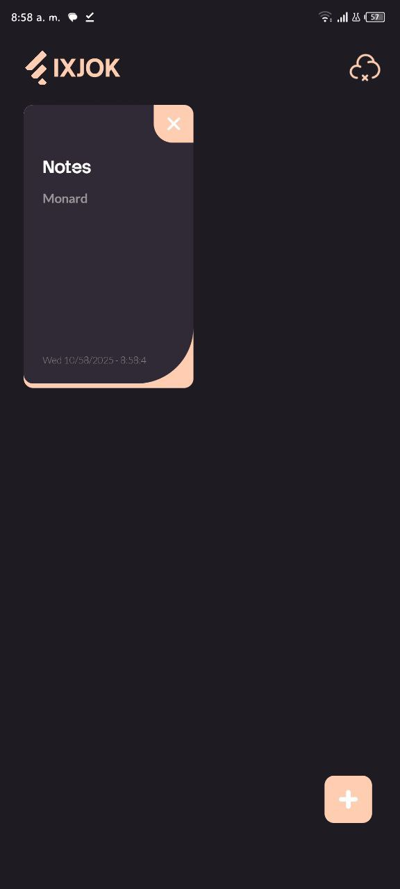
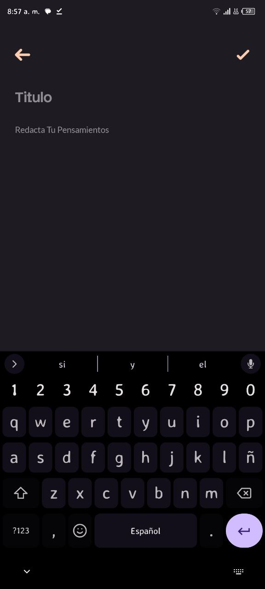
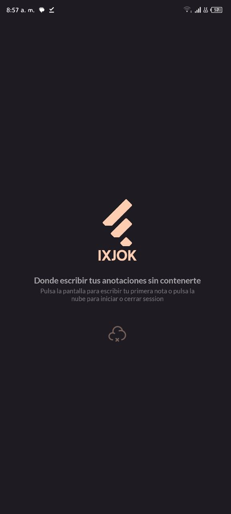

GitHub Copilot Chat Assistant

# Ixjok

A .NET MAUI mobile/desktop application (Ixjok) — cross-platform app targeting Android and Windows, built with .NET MAUI, Community Toolkit and SkiaSharp.

---

## Table of Contents
- Overview
- Screenshots
- Features
- Tech stack
- Requirements
- Setup (development)
- Build & Run
- Configuration
- Project structure
- Notes & security
- Contributing
- License

---

## Overview
Ixjok is a .NET MAUI application (single project) configured to run on:
- net10.0 (generic)
- net10.0-android
- net10.0-windows10.0.19041.0 (when building on Windows)

It uses MVVM and several services (authentication, navigation, storage, media) registered in the app startup. The app communicates with a backend API at https://ixjok.runasp.net/ (HttpClient base address configured).

---

## Screenshots
(Images taken from the repository Doc folder)

Use these relative paths to embed the images in the README as shown above. They are included in the repository under Doc/.

---

## Features (inferred from source)
- Cross-platform UI using .NET MAUI
- SkiaSharp-based graphics support
- CommunityToolkit.Maui + CommunityToolkit.Mvvm for helpers and MVVM
- Authentication services
- Navigation and view-model registration
- Media services (camera/gallery handling)
- Local storage (SQLite)
- HttpClient configured for backend connectivity
- Custom fonts included (Lato family, StackSansNotch)

---

## Tech stack / Dependencies
Key packages referenced in Ixjok.csproj:
- Microsoft.Maui.Controls (10.x)
- Microsoft.Maui.Essentials
- CommunityToolkit.Maui
- CommunityToolkit.Mvvm
- sqlite-net-pcl
- SQLitePCLRaw.bundle_green
- SkiaSharp.Extended.UI.Maui
- Microsoft.Extensions.DependencyInjection / Logging

Fonts registered in startup:
- Lato-Bold.ttf (alias: LB)
- Lato-Light.ttf (LL)
- Lato-Regular.ttf (LR)
- StackSansNotch-Bold.ttf (SB)
- StackSansNotch-SemiBold.ttf (SS)

Resources declared: AppIcon, Splash, Images, Fonts, Raw assets.

Project properties:
- ApplicationTitle: Ixjok
- ApplicationId: com.coollbreackerz.ixjok
- ApplicationVersion: 1.0 (version 1)

---

## Requirements
- .NET 10 SDK (preview may be required based on LangVersion)
- MAUI workload:
  - Visual Studio 2022/2023 with .NET MAUI workload (recommended)
  - or dotnet CLI with MAUI workloads installed (dotnet workload install maui)
- For Android builds: Android SDK, Android emulator or device
- For Windows builds: Windows 10 SDK (min version as defined in csproj)

---

## Setup (development)

1. Install .NET SDK and MAUI workload
   - Visual Studio with “.NET Multi-platform App UI development” workload (recommended)
   - or CLI:
     - dotnet workload install maui

2. Clone the repo
   - git clone https://github.com/CoollbreackerzSdo/Ixjok.App.git
   - cd Ixjok.App

3. Restore packages
   - dotnet restore

4. (Optional) Install any required local tools or additional workloads if prompted.

---

## Build & Run

Recommended: use Visual Studio with MAUI support and select target (Android emulator or Windows).

CLI examples:

- Build for Android (debug):
  - dotnet build -f net10.0-android -c Debug

- Build for Windows (on Windows machine):
  - dotnet build -f "net10.0-windows10.0.19041.0" -c Debug

- Publish for release Android (example):
  - dotnet publish -f net10.0-android -c Release -o ./publish/android

Notes:
- Visual Studio handles deployment to emulator/device automatically (use Run/Debug).
- The repository contains an keystore file (ixjok.keystore). If signing is required for publishing, configure signing properties and keep keystore credentials secure (do not commit private credentials).

---

## Configuration
- HTTP API base address is set in MauiProgram.cs:
  - new HttpClient { BaseAddress = new("https://ixjok.runasp.net/") }
  - Change this in MauiProgram.cs or use an environment / config mechanism if you want different endpoints for dev/prod.
- App icons and splash assets are declared in the csproj: Resources\AppIcon\appicon.svg and Resources\Splash\splash.svg.
- Fonts and images are in Resources and referenced in code/Startup.

---

## Project structure (high level)
Top-level folders (declared in csproj):
- Components (UI components/controls)
- Doc (screenshots / documentation images)
- Helpers
- Models
- Platforms (platform-specific entry points)
- Resources (App resources: Fonts, Images, Styles)
- Services (Auth, Media, Navigation, Repository, etc.)
- Tools (utilities, converters)

Important files:
- Ixjok.csproj — project configuration & dependencies
- MauiProgram.cs — app startup, DI, services registration
- App.xaml / App.xaml.cs — application resources and bootstrap
- ixjok.keystore — Android keystore (present in repo; ensure it should be public)

---

## Notes & Security
- A keystore file (ixjok.keystore) exists in the repository root. If this is a private signing key, consider removing it from the repo and using a secure secret store or GitHub Secrets for release signing.
- Check sensitive configuration before publishing.

---

## Contributing
- Fork the repository, create a feature branch, open a pull request.
- Keep changes focused and include a description of what you changed and why.
- For major changes, open an issue first to discuss design.

---

## License

MIT

---

If you want, I can:
- Create a README.md in the repository and commit it for you.
- Add a LICENSE file (pick a license and I’ll add it).
- Improve / tailor the README text (shorter or longer, add badges, CI examples). Which would you like me to do next?
